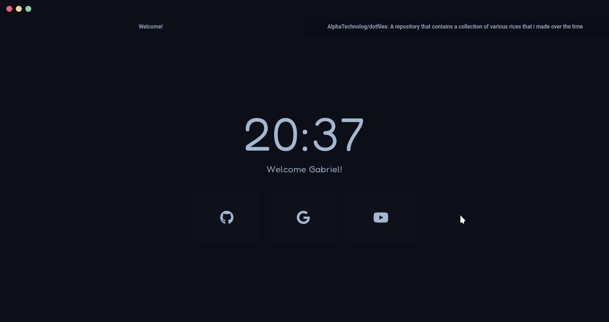

# Startpage

This is my own startpage for any browser made in vue 3 + typescript

## How it looks

## Installation

Well, just use [this extension](https://addons.mozilla.org/es/firefox/addon/new-tab-homepage/)
(you can use another of course.) and then follow the instructions
to set a custom startpage, use the next link as the url
of the start page: [https://alphatechnolog.github.io/startpage](https://alphatechnolog.github.io/startpage)
